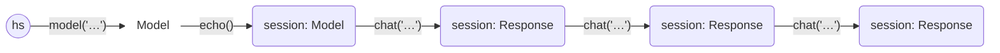
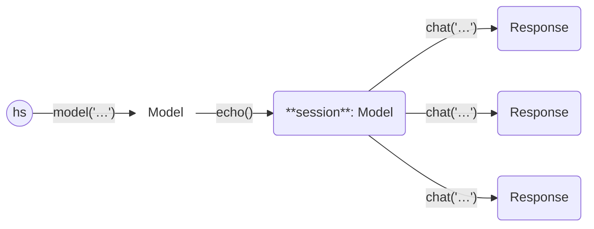

# Haverscript

Haverscript is a Python library for interacting with Large Language Models
(LLMs). Haverscript's concise syntax and powerful middleware allows for rapid
protyping with new use cases for LLMs, prompt engineering, and experimenting in
the emering field of LLM powered agents. Haverscript uses
[Ollama](https://ollama.com) by default but can use any OpenAI-style LLM API
with a simple adapter.

This is version 0.2 of Haverscript. The big change from 0.1 is the introduction
of middleware which cleans up various ad-hoc concepts from 0.1, and gives a
more principled basis for future tooling.

## First Example

Here’s a basic example demonstrating how to use Haverscript,
with the [mistral](https://mistral.ai/news/announcing-mistral-7b/) model.

```python
from haverscript import connect, echo

# Create a new session with the 'mistral' model and enable echo middleware
session = connect("mistral") | echo()

session = session.chat("In one sentence, why is the sky blue?")
session = session.chat("What color is the sky on Mars?")
session = session.chat("Do any other planets have blue skies?")
```

This will generate the following output

```markdown
> In one sentence, why is the sky blue?

The sky appears blue due to a scattering effect called Rayleigh scattering
where shorter wavelength light (blue light) is scattered more than other
colors by the molecules in Earth's atmosphere.

> What color is the sky on Mars?

The Martian sky appears red or reddish-orange, primarily because of fine dust
particles in its thin atmosphere that scatter sunlight preferentially in the
red part of the spectrum, which our eyes perceive as a reddish hue.

> Do any other planets have blue skies?

Unlike Earth, none of the other known terrestrial planets (Venus, Mars,
Mercury) have a significant enough atmosphere or suitable composition to cause
Rayleigh scattering, resulting in blue skies like we see on Earth. However,
some of the gas giant planets such as Uranus and Neptune can appear blueish
due to their atmospheres composed largely of methane, which absorbs red light
and scatters blue light.
```

Haverscript used markdown as its output format, allowing for easy rendering of any chat session.

The [examples](examples/README.md) directory contains several examples of Haverscript.

The [DSL Design](docs/DSL_DESIGN.md) page compares Haverscript to other LLM APIs,
and gives rationale behind the design.

## Installing Haverscript

Haverscript is available on GitHub: <https://github.com/andygill/haverscript>.
While Haverscript is currently in beta and still being refined, it is ready to use
out of the box.

### Prerequisites

You need to have [Ollama](https://ollama.com) already installed.

### Installation

You can install Haverscript directly from the GitHub repository using `pip`.

Here's how to set up Haverscript:

1. First, create and activate a Python virtual environment if you haven’t already:

```bash
python3 -m venv venv
source venv/bin/activate  # On Windows: .\venv\Scripts\activate
```

2. Install Haverscript directly from the GitHub repository:

```bash
pip install git+https://github.com/andygill/haverscript.git@v0.2.0
```

By default, Haverscript comes with Ollama support.
If you want to also install the `together.ai` API, you need to use

```bash
pip install "git+https://github.com/andygill/haverscript.git@v0.2.0[together]"
```

In the future, if there’s enough interest, I plan to push Haverscript to PyPI
for easier installation.

See [INSTALL.md](INSTALL.md) for additional details about installing, testing and
extended Haverscript.

## Documentation

### The `chat` Method

The `chat` method invokes the LLM, and is the principal method in HaveScript.
Everything else in Haverscripe is about setting up for `chat`, or using the output from `chat`.
The `chat` method is available in both the `Model` and its sub-class
`Response`:

```python
class Model:
    ...
    def chat(self, prompt: str, ...) -> Response:

class Response(Model):
    ...
```

Key points:
- **Immutability**: Both `Model` and `Response` are immutable data structures,
  making them safe to share across threads or processes without concern for side
  effects.
- **Chat Method**: The `chat` method accepts a simple Python string as input,
  which can include f-strings for formatted and dynamic prompts.
  
  Example:
  
  ```python
  def example(client: Model, txt: str):
      client.chat(
          f"""
          Help me understand what is happening here.
          
          {txt}
          """
      )
  ```

### The `Response` Class

The result of a `chat` call is a `Response`. This class contains several useful
attributes and defines a `__str__` method for convenient string representation.

```python 
@dataclass
class Response(Model):
    prompt: str
    reply: str
    parent: Model

    def __str__(self):
        return self.reply
    ...
```

Key Points:
- **Accessing the Reply**: You can directly access the `reply` attribute to
  retrieve the text of the `Response`, or simply call `str(response)` for the
  same effect.

- **String Representation**: The `__str__` method returns the `reply` attribute,
  so whenever a `Response` object is used inside an f-string, it automatically
  resolves to the text of the reply. (This is standard Python behavior.)

  For an example, see [Chaining answers together](examples/chaining_answers/README.md)

How do we modify a `Model` if everything is immutable? Instead of modifying them
directly, we create a new copy with every call to `.chat`, following the
principles of functional programming, and using the builder design pattern.

### The `Model` Class

The `connect(...)` function is the main entry point of the library, allowing you
to create and access an initial model. This function takes a model
name and returns a `Model` that will connect to Ollama and this model.

```python
def connect(modelname: str | None = None):
    ...
```

To create and use a model, follow the idiomatic approach of naming the model and
then using that name:

```python
from haverscript import connect
model = connect("mistral")
response = model.chat("In one sentence, why is the sky blue?")
print(f"Response: {response}")
```

You can create multiple models, including duplicates of the same model, without
any issues. No external actions are triggered until the `chat` method is called;
the external `connect` is deferred until needed.

### Chaining calls

There are two primary ways to use `chat`:

#### Chaining responses



This follows the typical behavior of a chat session: using the output of one
`chat` call as the input for the next. For more details, refer to the 
[first example](examples/first_example/README.md).

#### Multiple independent calls



Call `chat` multiple times with the same client instance to process different
prompts separately. This way intentually loses the chained context, but in some
cases you want to play a different persona, or do not allow the previous reply
to cloud the next request. See [tree of calls](examples/tree_of_calls/README.md)
for an example.


### Middleware

Middleware is a mechanism to have fine control over everything between calling
`.chat` and Haverscript calling the LLM. As a example, consider the creation of
a session.

```python
session = connect("mistral") | echo()
```

You can chain multiple middlewares together to achieve composite behaviors.

```python
session = connect("mistral") | echo() | options(seed=12345)
```

Finally, you can also add middleware to a specific call to chat.

```python
session = connect("mistral") | echo()
print(session.chat("Hello", middleware=options(seed=12345)))
```


Haverscript provides following middleware:

| Middleware | Purpose | Class |
|------------|---------|-------|
| model      | Request a specific model be used            | configuration | 
| options    | Set specific LLM options (such as seed)     | configuration |
| format     | Set specific format for output              | configuration |
| dedent     | Remove spaces from prompt                   | configuration |
| echo       | Print prompt and reply                      | observation |
| stats      | Print basic stats about LLM                 | observation |
| trace      | Log requests and responses                  | observation |
| transcript | Store a complete transcript of every call   | observation |
| retry      | retry on failure (using tenacity)           | reliablity |
| validation | Fail under given condition                  | reliablity |
| cache      | Store and/or query prompt-reply pairs in DB | efficency | 
| fresh      | Request a fresh reply (not cached)          | efficency |
| meta       | Support for generalized prompt and response transformations | generalization |

For a comprehensive overview of middleware,
please refer to the [Middleware Docs](docs/MIDDLEWARE.md) documentation.
For examples of middleware in used, see

* [System prompt](examples/tree_of_calls/README.md) in tree of calls,
* [enabling the cache](examples/cache/README.md), 
* [JSON output](examples/check/README.md) in checking output, and
* [setting ollama options](examples/options/README.md).

### Chat Options

The `.chat()` method has additional parameters that are specific
to the chat call.

```python
    def chat(
        self,
        prompt: str,
        images: list = [],
        middleware: Middleware | None = None,
    ) -> Response:
```

Specifically, `chat` takes things that are added to any context (prompt and
images), and additionally, any extra middleware.

### Other APIs

We support [together.ai](https://www.together.ai/). You need to provide your
own API KEY. Import `together` (which is a module), and use its `connect`.

```python
from haverscript import echo
from haverscript.together import connect

session = connect("meta-llama/Meta-Llama-3-8B-Instruct-Lite") | echo()

session = session.chat("Write a short sentence on the history of Scotland.")
session = session.chat("Write 500 words on the history of Scotland.")
session = session.chat("Who was the most significant individual in Scottish history?")
```

You need to set the TOGETHER_API_KEY environmental variable.

```shell
export TOGETHER_API_KEY=...
python example.py
```

You also need to include together when installing.

```
pip install "git+https://github.com/andygill/haverscript.git@v0.2.0[together]"
```

PRs supporting other API are welcome! There are two examples in the source,
the together API is in [together.py](src/haverscript/together.py),
and it should be straightforward to add more.

## FAQ

Q: How do I make the context window larger to (say) 16K?

A: set the `num_ctx` option using middleware.
```python
model = model | options(num_ctx=16 * 1024)
```

Q: How do get JSON output?

A: set the `format` middleware, typically given as an argument to `chat`,
because it is specific to this call.
```python
... = model.chat("...", middleware=format())
```

Q: What is "haver"?

A: It's a Scottish term that means to talk aimlessly or without necessarily
making sense.


## Generative AI Usage

Generative AI was used as a tool to help with code authoring and documentation
writing.
