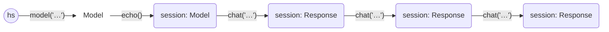
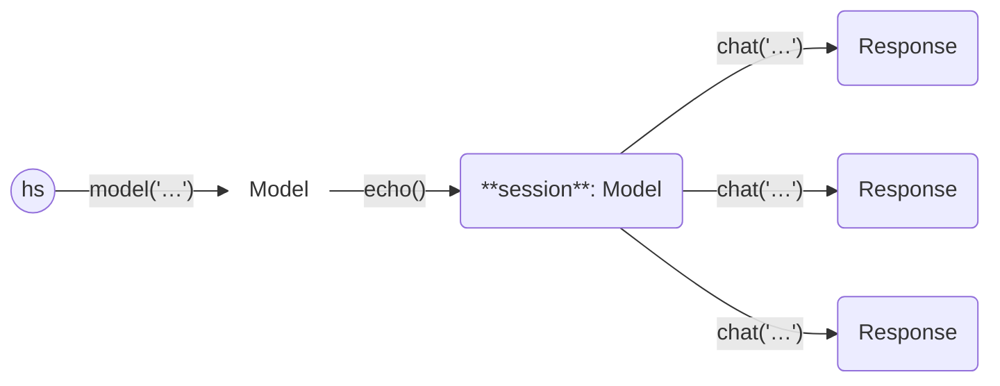

# Haverscript

Haverscript is a lightweight Python library designed to manage LLM interactions,
built on top of [Ollama](https://ollama.com), and its [Python
API](https://github.com/ollama/ollama-python). Haverscript streamlines LLM
interactions by focusing on immutability, automating retries, and utilizing
SQLite caching. This ensures efficient, reliable, and repeatable outcomes while
reducing the complexity of managing LLM workflows.

## First Example

Here’s a basic example demonstrating how to use Haverscript,
with the [mistral](https://mistral.ai/news/announcing-mistral-7b/) model.

```python
from haverscript import connect
session = connect("mistral").echo()
session = session.chat("In one sentence, why is the sky blue?")
session = session.chat("Rewrite the above sentence in the style of Yoda")
session = session.chat("How many questions did I ask?")
```

This will give the following output.

```markdown
> In one sentence, why is the sky blue?

The sky appears blue due to scattering of shorter wavelengths (blue and violet)
more than other colors by the atmosphere when sunlight enters it.

> Rewrite the above sentence in the style of Yoda

In the atmosphere, scattering of blue and violet light, more abundant, is.
This explains why sky looks blue to our eyes.

> How many questions did I ask?

You asked three questions in total: one about the reason for the blue color of the
sky, another asking me to rewrite that answer in the style of Yoda, and a third
confirming how many questions you had asked.
```

The [examples](examples/README.md) directory contains several examples.

The [DSL Design](DSL_DESIGN.md) page compares Haverscript to other LLM APIs,
and gives rationale behind the design.

## Installing Haverscript

Haverscript is available on GitHub: <https://github.com/andygill/haverscript>.
While it is currently in alpha and considered experimental, it is ready to use
out of the box.

### Prerequisites

You need to have [Ollama](https://ollama.com) already installed, or
have access to an an Ollama compatible API end-point. 

### Installation

You can install Haverscript directly from the GitHub repository using `pip`.


Here's how to set up Haverscript:

1. First, create and activate a Python virtual environment if you haven’t already:

```bash
python3 -m venv venv
source venv/bin/activate  # On Windows: .\venv\Scripts\activate
```

2. Install Haverscript directly from the GitHub repository:

```bash
pip install git+https://github.com/andygill/haverscript.git@v0.1.0
```

In the future, if there’s enough interest, I plan to push Haverscript to PyPI
for easier installation.

## Documentation

### The `chat` Method

The `chat` method is the main function available in both the `Model` and
`Response` classes (with `Response` inheriting it from `Model`):

```python
@dataclass(frozen=True)
class Model:
    ...
    def chat(self, prompt: str) -> Response:

@dataclass(frozen=True)
class Response(Model):
    ...
```

Key points:
- **Immutability**: Both `Model` and `Response` are immutable data structures,
  making them safe to share across threads or processes without concern for side
  effects.
- **Chat Method**: The `chat` method accepts a simple Python string as input,
  which can include f-strings for formatted and dynamic prompts.
  
  Example:
  
  ```python
  def example(client: Model, txt: str):
      client.chat(
          f"""
          Help me understand what is happening here.
          
          {txt}
          """
      )
  ```

- **Automatic Outdenting**: To accommodate common formatting practices where
  `chat` is called with multi-line literal strings (often indented), the
  "docstrings" algorithm is applied to remove unnecessary whitespace from the
  prompt. You can disable this by setting the `raw` option before calling
  `chat`.

### The `Response` Class

The result of a `chat` call is a `Response`. This class contains several useful
attributes and defines a `__str__` method for convenient string representation.

```python 
class Response(Model):
    prompt: str
    reply: str
    parent: Model

    def __str__(self):
        return self.reply
    ...
```

Key Points:
- **Accessing the Reply**: You can directly access the `reply` attribute to
  retrieve the text of the `Response`, or simply call `str(response)` for the
  same effect.

- **String Representation**: The `__str__` method returns the `reply` attribute,
  so whenever a `Response` object is used inside an f-string, it automatically
  resolves to the text of the reply. (This is standard Python behavior.)

  For and example, see [Chaining answers together](examples/chaining_answers/README.md)

- **`str` and `repr`**: The design of the `str` method in Haverscript is
  intentional. It allows you to seamlessly include responses directly in
  f-strings. If you need to inspect more detailed information or structure, you
  can use `repr` or `dataclasses.asdict`.

### The `Model` Class

The `connect(...)` function is the main entry point of the library, allowing you
to create and access an initial model. This function always requires a model
name and can optionally accept a hostname (which is typically omitted when
running Ollama locally).

```python
def connect(modelname: str, hostname: str = None):
    ...
```

To create and use a model, follow the idiomatic approach of naming the model and
then using that name:

```python
from haverscript import connect
model = connect("mistral")
response = model.chat("In one sentence, why is the sky blue?")
print(f"Response: {response}")
```

You can create multiple models, including duplicates of the same model, without
any issues. No external actions are triggered until the `chat` method is called;
the external `connect` is deferred until needed.

### Setting Parameters

How do we modify a `Model` or `Response` if everything is immutable? Instead of
modifying them directly, we create new versions with the desired changes,
following the principles of functional programming. Helper methods make it easy
to create updated versions of these objects while preserving immutability.

```python
class Model:
    ...
    def echo(self, echo: bool = True, colorize: Optional[str] = None, width: int = 78) -> Self:
        """Echo prompts and responses to stdout."""

    def cache(self, filename: Optional[str] = None):
        """Set the cache filename for this model."""

    def system(self, prompt: str) -> Self:
        """Add a system prompt."""

    def json(self, json: bool = True) -> Self:
        """Request a JSON result."""

    def options(self, **kwargs) -> Self:
        """Set additional options for the model, like temperature and seed."""
```

These methods can be called on both `Model` and `Response`, returning a new
instance of the same type with the specified attributes updated.

For examples, see 

* [System prompt](examples/tree_of_calls/README.md) in tree of calls,
* [enabling the cache](examples/cache/README.md), 
* [JSON output](examples/check/README.md) in checking output, and
* [setting ollama options](examples/options/README.md).

### Chaining calls

There are two primary ways to use `chat`:

#### Chaining responses



This follows the typical behavior of a chat session: using the output of one
`chat` call as the input for the next. For more details, refer to the [first
example](examples/first_example/README.md).

#### Multiple independent calls



Call `chat` multiple times with the same client instance to process different
prompts separately. This way intentually loses the chained context, but in some
cases you want to play a different persona, or do not allow the previous reply
to cloud the next request. See [tree of calls](examples/tree_of_calls/README.md)
for an example.

### Post-conditions

A `Response` can have post-conditions added using the `check` method.

```python
class Response(Model):
    ...
    def check(self, predicate) -> Self:
        """Verify that a predicate is true, and if not, rerun the prompt."""
```

For example, you might use `check` to verify that an output is formatted
correctly. Calls to `check` can be chained, and all post-conditions must be
satisfied for the process to continue.

There are three predicate functions provided:

```python
from haverscript import fresh, accept, valid_json

  response.check(fresh)  # Ensures the response is freshly generated (not cached).
  response.check(accept)  # Asks the user to confirm if the response is acceptable.
  response.check(valid_json)  # Check to see if the response reply is valid JSON.
```

For examples, see [post-conditions](examples/check/README.md).

## FAQ

Q: How do I make the context window larger to (say) 16K?

A: set the `num_ctx` option.
```python
model = model.options(num_ctx=16 * 1024)
```

Q: What is "haver"?

A: It's a Scottish term that means to talk aimlessly or without necessarily
making sense.

## Generative AI Usage

Generative AI was used as a tool to help with code authoring and documentation
writing.

## Future Plans

Models

* Add support for the OpenAI API, and other APIs.
* Introduce pseudo-models for tasks such as random selection.

External Artifacts

* ~~Enable image input for multi-modal models during chats~~.
* Provide an API for LLM-based function calls.
* Incorporate Retrieval-Augmented Generation (RAG) capabilities.

Interface

* Develop a [gradio](https://www.gradio.app/) interface for replaying scripts and monitoring LLM usage.

LLM Hacking

* Implement context compression and support for rewriting conversation
  histories.
