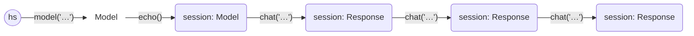
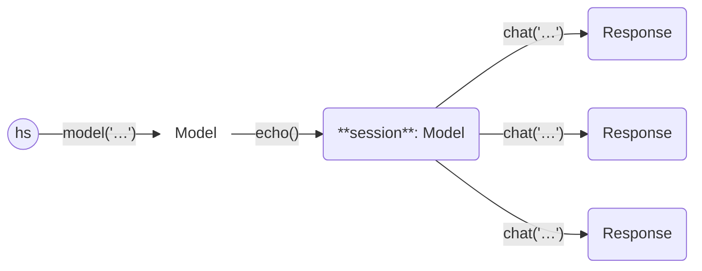

# Haverscript

Haverscript is a lightweight Python library designed to manage LLM interactions.
Haverscript used [Ollama](https://ollama.com) by default but can use any API
with a simple adapter. Haverscript streamlines LLM
interactions by utilizing immutability, taking care of context construction
automatically, and having a flexible and composable middleware support.
This reduces the complexity of managing LLM workflows, and allows
for rapid experimentation of ideas.

## First Example

Here’s a basic example demonstrating how to use Haverscript,
with the [mistral](https://mistral.ai/news/announcing-mistral-7b/) model.

```python
from haverscript import connect
session = connect("mistral") | echo()
session = session.chat("In one sentence, why is the sky blue?")
session = session.chat("Rewrite the above sentence in the style of Yoda")
session = session.chat("How many questions did I ask?")
```

This will give the following output.

```markdown
> In one sentence, why is the sky blue?

The sky appears blue due to scattering of shorter wavelengths (blue and violet)
more than other colors by the atmosphere when sunlight enters it.

> Rewrite the above sentence in the style of Yoda

In the atmosphere, scattering of blue and violet light, more abundant, is.
This explains why sky looks blue to our eyes.

> How many questions did I ask?

You asked three questions in total: one about the reason for the blue color of the
sky, another asking me to rewrite that answer in the style of Yoda, and a third
confirming how many questions you had asked.
```

The [examples](examples/README.md) directory contains several examples.

The [DSL Design](docs/DSL_DESIGN.md) page compares Haverscript to other LLM APIs,
and gives rationale behind the design.

## Installing Haverscript

Haverscript is available on GitHub: <https://github.com/andygill/haverscript>.
While it is currently in alpha and considered experimental, it is ready to use
out of the box.

### Prerequisites

You need to have [Ollama](https://ollama.com) already installed, or
have access to an an Ollama compatible API end-point. 

### Installation

You can install Haverscript directly from the GitHub repository using `pip`.


Here's how to set up Haverscript:

1. First, create and activate a Python virtual environment if you haven’t already:

```bash
python3 -m venv venv
source venv/bin/activate  # On Windows: .\venv\Scripts\activate
```

2. Install Haverscript directly from the GitHub repository:

```bash
pip install git+https://github.com/andygill/haverscript.git@v0.2.0
```

In the future, if there’s enough interest, I plan to push Haverscript to PyPI
for easier installation.

## Documentation

### The `chat` Method

The `chat` method is the main function available in both the `Model` and
`Response` classes (with `Response` inheriting it from `Model`):

```python
class Model:
    ...
    def chat(self, prompt: str) -> Response:

class Response(Model):
    ...
```

Key points:
- **Immutability**: Both `Model` and `Response` are immutable data structures,
  making them safe to share across threads or processes without concern for side
  effects.
- **Chat Method**: The `chat` method accepts a simple Python string as input,
  which can include f-strings for formatted and dynamic prompts.
  
  Example:
  
  ```python
  def example(client: Model, txt: str):
      client.chat(
          f"""
          Help me understand what is happening here.
          
          {txt}
          """
      )
  ```

### The `Response` Class

The result of a `chat` call is a `Response`. This class contains several useful
attributes and defines a `__str__` method for convenient string representation.

```python 
@dataclass
class Response(Model):
    prompt: str
    reply: str
    parent: Model

    def __str__(self):
        return self.reply
    ...
```

Key Points:
- **Accessing the Reply**: You can directly access the `reply` attribute to
  retrieve the text of the `Response`, or simply call `str(response)` for the
  same effect.

- **String Representation**: The `__str__` method returns the `reply` attribute,
  so whenever a `Response` object is used inside an f-string, it automatically
  resolves to the text of the reply. (This is standard Python behavior.)

  For and example, see [Chaining answers together](examples/chaining_answers/README.md)

- **`str` and `repr`**: The design of the `str` method in Haverscript's
  `Response` is intentional. It allows you to seamlessly include responses
  directly in f-strings. If you need to inspect more detailed information or
  structure, you can use `repr`.

How do we modify `Model` if everything is immutable? Instead of modifying them
directly, we create a new copy with every call to `.chat`, following the
principles of functional programming. 

### The `Model` Class

The `connect(...)` function is the main entry point of the library, allowing you
to create and access an initial model. This function takes a model
name and returns a `Model` that will connect to Ollama and this model.

```python
def connect(modelname: str | None = None):
    ...
```

To create and use a model, follow the idiomatic approach of naming the model and
then using that name:

```python
from haverscript import connect
model = connect("mistral")
response = model.chat("In one sentence, why is the sky blue?")
print(f"Response: {response}")
```

You can create multiple models, including duplicates of the same model, without
any issues. No external actions are triggered until the `chat` method is called;
the external `connect` is deferred until needed.

### Chaining calls

There are two primary ways to use `chat`:

#### Chaining responses



This follows the typical behavior of a chat session: using the output of one
`chat` call as the input for the next. For more details, refer to the [first
example](examples/first_example/README.md).

#### Multiple independent calls



Call `chat` multiple times with the same client instance to process different
prompts separately. This way intentually loses the chained context, but in some
cases you want to play a different persona, or do not allow the previous reply
to cloud the next request. See [tree of calls](examples/tree_of_calls/README.md)
for an example.


### Middleware

Middleware is a mechansim to have fine control over everything between
calling `.chat` and Haverscript calling the LLM.
As a example, consider the creation of a session.

```python
session = connect("mistral") | echo()
```

You can combine multiple middlewares, as deep as needed.

```python
session = connect("mistral") | echo() | options(seed=12345)
```

Finally, you can also add middleware to a specific call to chat.

```python
session = connect("mistral") | echo()
print(session.chat("Hello", middleware=options(seed=12345)))
```


Haverscript provides following middleware:

| Middleware | Purpose | Class |
|------------|---------|-------|
| Retry      | retry on failure (using tenacity)           | reliablity |
| Validation | Fail under given condition                  | reliablity |
| Cache      | Store and/or query prompt-reply pairs in DB | efficency | 
| Fresh      | Request a fresh reply (not cached)          | efficency |
| Echo       | Print prompt and reply                      | observation |
| Stats      | Print basic stats about LLM                 | observation |
| Debug      | Log requests and responses                  | observation |
| Transcript | Store a complete transcript of every call   | observation |
| Model      | Request a specific model be used            | configuration | 
| Options    | Set specific LLM options (such as seed)     | configuration |
| format     | Set specific format for output              | configuration |
| Meta       | Support for generalized prompt and response transformation | generalization |


For more details, see [Middleware Docs](docs/MIDDLEWARE.md), and 
for examples, see

* [System prompt](examples/tree_of_calls/README.md) in tree of calls,
* [enabling the cache](examples/cache/README.md), 
* [JSON output](examples/check/README.md) in checking output, and
* [setting ollama options](examples/options/README.md).

### Chat Options

The `.chat()` method has additional parameters that are specific
to the chat call.

```python
    def chat(
        self,
        prompt: str,
        format: str | dict = "", # middleware
        images: list[AnyStr] = [], # not middleware (part of context)
        middleware: Middleware | None = None,
        raw: bool = False, # remove?
    ) -> Response:
```

### Other APIs

We support [together.ai](https://www.together.ai/). You need to provide your
own API KEY. Import `together` (which is a module), and use its `connect`.

```python
from haverscript import echo, together
session = together.connect("mistral") | echo()
session = session.chat("In one sentence, why is the sky blue?")
session = session.chat("Rewrite the above sentence in the style of Yoda")
session = session.chat("How many questions did I ask?")
```

You need to set the TOGETHER_API_KEY environmental variable.

```shell
export TOGETHER_API_KEY=...
python example.py
```

PRs supporting other API are welcome! There are two examples in the source,
so it should be straightforward to add more.

## FAQ

Q: How do I make the context window larger to (say) 16K?

A: set the `num_ctx` option using middleware.
```python
model = model | options(num_ctx=16 * 1024)
```

Q: What is "haver"?

A: It's a Scottish term that means to talk aimlessly or without necessarily
making sense.

## Generative AI Usage

Generative AI was used as a tool to help with code authoring and documentation
writing.
