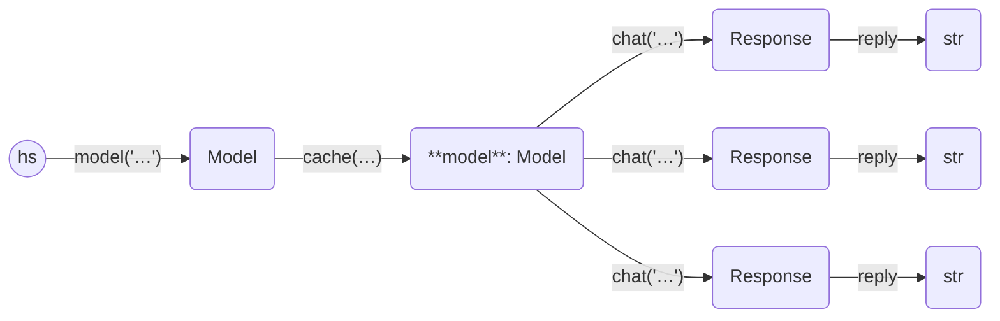

Here is an example of using the cache. We use SQLite, and files by convention
use a `.db` suffix. Note that we do not turn on `echo` here but store the replies instead.

```python
from haverscript import connect
import time

model = connect("mistral").cache("cache.db")

prompt = "In one sentence, why is the sky blue?"
times = []
replies = []
times.append(time.time())
for _ in range(2):
    replies.append(model.chat(prompt).reply)
    times.append(time.time())

for i, (t1, t2, r) in enumerate(zip(times, times[1:], replies)):
    print(f"chat #{i}")
    print("reply:", r)
    print("time: {:.5f}".format(t2 - t1))
    print()

print(len(model.children(prompt)), "replies are in cache")
```

The first run, with argument 2, produces:

```
0 replies are in cache at start of run
chat #0
reply:  The sky appears blue due to scattering of shorter wavelengths (blue and violet) of sunlight by the atmosphere more than other colors before reaching our eyes.
time: 1.23832

chat #1
reply:  The sky appears blue due to scattering of shorter wavelengths (blue and violet) more than other colors in sunlight by molecules and particles in Earth's atmosphere.
time: 1.21506

2 replies are in cache at end of run
```

Second time, with the cache intact inside "cache.db", and an argument of 3, gives:

```
2 replies are in cache at start of run
chat #0
reply:  The sky appears blue due to scattering of sunlight by molecules and particles in the Earth's atmosphere.
time: 0.00006

chat #1
reply:  The sky appears blue due to the scattering of shorter wavelengths (blue and violet) of sunlight by the atmosphere more than other colors before reaching our eyes.
time: 0.00001

chat #2
reply:  The sky appears blue due to the scattering of sunlight by the gases and particles in the Earth's atmosphere, with shorter wavelengths (blue light) being more easily scattered than longer ones.
time: 1.55286

3 replies are in cache at end of run
```

There are two cached values at the start of the run, so we use the most up-to-date replies, in turn. The final call to `chat` calls the LLM.

The cache can be access using `model.children()`, which will return a list of all possible
`Response` values that are cached, or `model.children(prompt)`, which  which will return 
all cached `Response` values that were a response to the given `prompt`.

----



----