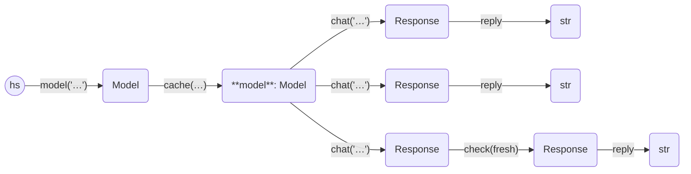

Here is an example of using the cache. We use SQLite, and files by convention
use a `.db` suffix. Note that we do not turn on `echo` here but store the replies instead.

```python
from haverscript import connect
import time

model = connect("mistral").cache("cache.db")

prompt = "In one sentence, why is the sky blue?"
times = []
replies = []
times.append(time.time())
replies.append(model.chat(prompt).reply)
times.append(time.time())
replies.append(model.chat(prompt).reply)
times.append(time.time())
replies.append(model.chat(prompt).check(fresh).reply)
times.append(time.time())

for i, (t1, t2, r) in enumerate(zip(times, times[1:], replies)):
    print(f"chat #{i}")
    print("reply:", r)
    print("time: {:.5f}".format(t2 - t1))
    print()

print(len(model.children(prompt)), "replies are cached")

```

The first run produces:

```
chat #0
reply:  The sky appears blue due to scattering of shorter wavelengths (blue and violet) of sunlight by atmospheric molecules and particles more than other colors. This phenomenon is called Rayleigh scattering.
time: 1.52271

chat #1
reply:  The sky appears blue due to scattering of shorter wavelengths (blue and violet) of sunlight by atmospheric molecules and particles more than other colors. This phenomenon is called Rayleigh scattering.
time: 0.00004

chat #2
reply:  The sky appears blue due to scattering of shorter wavelengths (blue and violet) more than longer wavelengths (yellow, orange, and red) by molecules and particles in the Earth's atmosphere.
time: 1.51861

2 replies are cached
```

 * chat #0 is generated
 * chat #1 is pulled from the cache
 * chat #2 is pulled from the cache, rejected because it is not fresh, and then regenerated.
 * The cache contains 2 possible replies to the prompt

Second time, with the cache intact inside "cache.db", gives:

```
chat #0
reply:  The sky appears blue due to scattering of shorter wavelengths (blue and violet) more than longer wavelengths (yellow, orange, and red) by molecules and particles in the Earth's atmosphere.
time: 0.00090

chat #1
reply:  The sky appears blue due to scattering of shorter wavelengths (blue and violet) more than longer wavelengths (yellow, orange, and red) by molecules and particles in the Earth's atmosphere.
time: 0.00003

chat #2
reply:  The sky appears blue due to scattering of shorter wavelengths (blue and violet) of sunlight by the atmosphere more than other colors before reaching our eyes.
time: 1.18642

3 replies are cached
```

 * chat #0 is pulled from the cache
 * chat #1 is pulled from the cache
 * chat #2 is pulled from the cache, rejected because it is not fresh, and the regenerated as a fresh result.
 * The cache now contains 3 possible replies to the prompt


There are two cached values at the start of the run, so we use the most up-to-date reply.

----



----