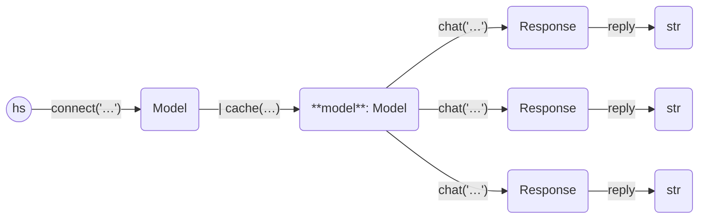

Here is an example of using the cache. We use SQLite, and files by convention
use a `.db` suffix. Note that we do not turn on `echo` here but store the replies instead.

```python
from haverscript import connect, cache, options
import time
import sys

# This enabled the cache
model = connect("mistral") | cache("cache.db")

prompt = "In one sentence, why is the sky blue?"
times = []
replies = []

# This runs a query several times, returning any cached answer first
times.append(time.time())
for i in range(int(sys.argv[1])):
    replies.append(model.chat(prompt, middleware=options(seed=i)).reply)
    times.append(time.time())

for i, (t1, t2, r) in enumerate(zip(times, times[1:], replies)):
    print(f"chat #{i}")
    print("reply:", r)
    print("fast (used cache)" if t2 - t1 < 0.5 else "slower (used LLM)")
    print()
```

The first run, with argument 2, produces:

```
chat #0
reply:  The sky appears blue due to a scattering effect called Rayleigh scattering where shorter wavelength light (blue light) is scattered more than other colors by the molecules in Earth's atmosphere.
slower (used LLM)

chat #1
reply:  The sky appears blue due to a scattering effect called Rayleigh scattering where shorter wavelength light (blue light) is scattered more than other colors by the molecules in Earth's atmosphere.
slower (used LLM)

```

Second time, with the cache intact inside "cache.db", and an argument of 3, gives:

```
chat #0
reply:  The sky appears blue due to a scattering effect called Rayleigh scattering where shorter wavelength light (blue light) is scattered more than other colors by the molecules in Earth's atmosphere.
fast (used cache)

chat #1
reply:  The sky appears blue due to a scattering effect called Rayleigh scattering where shorter wavelength light (blue light) is scattered more than other colors by the molecules in Earth's atmosphere.
fast (used cache)

chat #2
reply:  The sky appears blue due to a scattering effect called Rayleigh scattering where shorter wavelength light (blue light) is scattered more than other colors by the molecules in Earth's atmosphere.
slower (used LLM)

```

There are two cached values at the start of the second run, so we use the most
up-to-date replies, in turn. The final call to `chat` calls the LLM.

The cache can be access using `model.children()`, which will return a list of
all possible `Response` values that are cached, or `model.children(prompt)`,
which  which will return all cached `Response` values that were a response to
the given `prompt`.

----



----