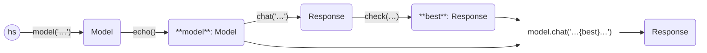

In this example, we ask a question and then ask the same LLM (without context)
whether it agrees.

```python
from haverscript import connect, stop_after_attempt, echo, validate, retry


def small(reply):
    # Ensure the reply is three words or fewer
    return len(reply.split()) <= 3


model = connect("mistral") | echo()

best = model.chat(
    "Name the best basketball player. Only name one player and do not give commentary.",
    middleware=validate(small) | retry(stop=stop_after_attempt(10)),
)
model.chat(
    f"Someone told me that {best} is the best basketball player. Do you agree, and why?"
)
```


```markdown
> Name the best basketball player. Only name one player and do not give commentary.

Michael Jordan

> Someone told me that  Michael Jordan is the best basketball player. Do you agree, and why?

While it's subjective and opinions on who is the "best" basketball player can
vary greatly among basketball fans, Michael Jordan is widely regarded as one
of the greatest players in the history of the sport. His impact on the game
both on and off the court is undeniable.

Jordan led the Chicago Bulls to six NBA championships and was named the Most
Valuable Player (MVP) five times during his career. He is also a 14-time NBA
All-Star, a 10-time scoring champion, a three-time steals leader, and a 3x
three-point shooting champion.

Jordan's influence extended beyond statistics as well. His competitive spirit,
passion for the game, and innovative style of play revolutionized basketball
in ways that continue to be felt today. He elevated the NBA brand globally and
inspired countless athletes across multiple sports.

That being said, it's important to recognize that there have been many
extraordinary players in the history of basketball, and debate over who is the
"best" will likely never reach a consensus. Other notable contenders for this
title include LeBron James, Kareem Abdul-Jabbar, Wilt Chamberlain, Magic
Johnson, and Larry Bird, among others.
```

Here is the flow diagram. Note that the final call to `chat` uses both the `model`,
and `best` to generate the final `Response`.

----



----
