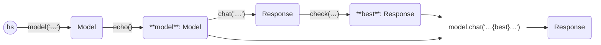

In this example, we ask a question and then ask the same LLM (without context)
whether it agrees.

```python
from haverscript import connect

model = connect("mistral").echo()

best = model.chat(
    "Name the best basketball player. Only name one player and do not give commentary."
).check( # Ensure the reply is three words or fewer
    lambda response: len(response.reply.split()) <= 3
)

model.chat(
    f"Someone told me that {best} is the best basketball player. Do you agree, and why?"
)
```


```
> Name the best basketball player. Only name one player and do not give commentary.

Michael Jordan.

> Someone told me that  Michael Jordan. is the best basketball player. Do you agree, and why?

Michael Jordan is considered by many to be the greatest basketball player of all time due to
his exceptional skills, achievements, and impact on the sport. Here are some reasons why:

1. Scoring Ability: MJ was an incredibly prolific scorer. He averaged over 30 points per
game in eight NBA seasons, and his career scoring average was 30.1 points per game. He could
score in various ways – with his athleticism, mid-range jumpers, and long-range shots.

2. Versatility: MJ was not just a scorer; he was also an excellent defender, rebounder, and
playmaker. His versatility allowed him to dominate games in multiple areas.

3. Competitive Fire: Jordan's competitiveness drove him to push himself and his teammates
to be better. He wanted to win at all costs and was known for his intense focus and drive during
games.

4. Leadership: MJ was a leader on the court, inspiring his teammates with his work ethic,
intensity, and determination. His presence helped elevate his teams to new heights.

5. Titles and Accomplishments: Jordan won six NBA championships with the Chicago Bulls. He
was named NBA Most Valuable Player (MVP) five times, an All-Star 14 times, and a member of the
All-NBA First Team 10 times.

6. Legacy: MJ's impact on basketball goes beyond his individual accomplishments. His
innovative skills, work ethic, and competitive spirit inspired generations of
basketball players and fans alike. He helped popularize the game globally and left an
indelible mark on the sport.
```

Here is the flow diagram. Note that the final call to `chat` uses both the `model`,
and `best` to generate the final `Response`.

----



----
