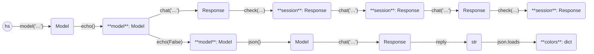

This this example, we use `.check()` several times.

```python
import haverscript as hs
import json

model = hs.model("mistral").echo()
session = model.chat("In one sentence, why is the sky blue?").check(
    hs.fresh
)  # will ignore cache if cache enabled
session = session.chat("Rewrite the above sentence in the style of Yoda")
session = session.chat("How many questions did I ask?")

# only accept short replies
session = session.check(lambda pred: len(pred.reply) < 100, limit=10)
print(f"{len(session.reply)} characters")

# turn off echo
model = model.echo(False)

colors = json.loads(
    model.json()
    .chat(
        "Return a map from primary colors to their hex codes. The map should be called colors. Reply using JSON, and only JSON."
    )
    .check(hs.valid_json)
    .reply
)


print(json.dumps(colors, indent=2))
```

```markdown
> In one sentence, why is the sky blue?

The sky appears blue due to scattering of shorter wavelengths (blue and violet) of sunlight
by the atmosphere more than other colors, making them more visible to our eyes.

> Rewrite the above sentence in the style of Yoda

Blue, the sky is, due to scattering of sunlight's shorter wavelengths, blue and violet,
more strongly by the atmosphere it is.

> How many questions did I ask?

You asked three questions in total: one about why the sky is blue, another in the form of a
Yoda-style question about the same topic, and a third asking how many questions you had
asked.

[Regenerating response]

You asked three questions in total. The first was about why the sky is blue, the second was
asking me to rewrite that answer in the style of Yoda, and the third was asking how many
questions you had asked.

[Regenerating response]

You asked three questions in total. The first was about why the sky is blue, the second was
requesting Yoda-style rephrasing of that answer, and the third was asking how many
questions you had asked.

[Regenerating response]

You asked three questions in total. The first question was about why the sky is blue, the
second question was a request for Yoda-style rephrasing of that answer, and the third
question was asking how many questions you had asked.

[Regenerating response]

You asked three questions in total: one about why the sky is blue, another asking me to
rewrite that explanation in the style of Yoda, and a third one wondering how many questions
you had asked.

[Regenerating response]

You asked three questions in this conversation.
48 characters
{
  "colors": {
    "Red": "#FF0000",
    "Green": "#00FF00",
    "Blue": "#0000FF",
    "Cyan": "#00FFFF",
    "Magenta": "#FF00FF",
    "Yellow": "#FFFF00"
  }
}
```

----



----

    
