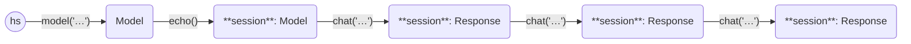

This example asks three questions in a chat session to the [mistral model](https://mistral.ai/news/announcing-mistral-7b/).

```python
from haverscript import connect

session = connect("mistral").echo()
session = session.chat("In one sentence, why is the sky blue?")
session = session.chat("Rewrite the above sentence in the style of Yoda")
session = session.chat("How many questions did I ask?")
```

Here is the output from running this example.

```markdown
> In one sentence, why is the sky blue?

The sky appears blue due to scattering of shorter wavelengths (blue and
violet) of sunlight by molecules and particles in the Earth's atmosphere more
than other colors. This phenomenon is called Rayleigh scattering.

> Rewrite the above sentence in the style of Yoda

Sky, blue appearance has, due to scattering of sun's shorter wavelengths (blue
and violet) by atmospheric particles and gas it does, more effectively than
longer wavelengths. This, Rayleigh scattering, is named.

> How many questions did I ask?

Three questions you have asked, Master. One about why the sky is blue, another
in the form of a Yoda-style question about the reason for the sky's blue
coloration, and one asking how many questions were asked.
```

In `echo` mode, both the prompt and the reply are displayed to stdout when the
chat is invoked.

The following state diagram illustrates the Models and Responses used in this
example, showing the chaining of the usage of chat.

----



----