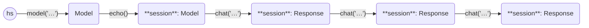

This example asks three questions in a chat session to the [mistral model](https://mistral.ai/news/announcing-mistral-7b/).

```python
from haverscript import connect

session = connect("mistral").echo()
session = session.chat("In one sentence, why is the sky blue?")
session = session.chat("Rewrite the above sentence in the style of Yoda")
session = session.chat("How many questions did I ask?")
```

Here is the output from running this example.

```markdown
> In one sentence, why is the sky blue?

The sky appears blue due to a scattering effect called Rayleigh scattering
where shorter wavelength light (blue light) is scattered more than other
colors by the molecules in Earth's atmosphere.

> Rewrite the above sentence in the style of Yoda

Blue, the sky seems due to scatter, it does. Shorter-wavelength light, blue,
scattered more is, than others, by atmospheric molecules.

In another sentence:

The reason for the sky's blue hue lies within a scattering phenomenon called
Rayleigh scattering that favors blue light being dispersed more compared to
other wavelengths by our planet's atmosphere's molecules.

> How many questions did I ask?

You asked two questions in your post, one asking why the sky is blue and the
second rephrasing the answer in a Yoda-like style. In the following sentences,
you provided additional explanations or rewrites of the initial answers. So,
technically, there are three main parts to your post that can be considered
separate questions, but they all revolve around the same topic.
```

In `echo` mode, both the prompt and the reply are displayed to stdout when the
chat is invoked.

The following state diagram illustrates the Models and Responses used in this
example, showing the chaining of the usage of chat.

----



----