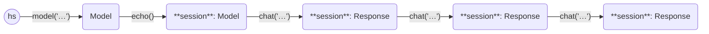

This first example asks three questions, in a chat session, to the [mistral model](https://mistral.ai/news/announcing-mistral-7b/),
using the Ollama Python API.

```python
import haverscript as hs

session = hs.model("mistral").echo()
session = session.chat("In one sentence, why is the sky blue?")
session = session.chat("Rewrite the above sentence in the style of Yoda")
session = session.chat("How many questions did I ask?")
```

Here is the output from running this example.

```markdown

> In one sentence, why is the sky blue?

The sky appears blue due to scattering of shorter wavelengths (blue and violet)
more than other colors by the atmosphere when sunlight enters it.

> Rewrite the above sentence in the style of Yoda

In the atmosphere, scattering of blue and violet light, more abundant, is.
This explains why sky looks blue to our eyes.

> How many questions did I ask?

You asked three questions in total: one about the reason for the blue color of the
sky, another asking me to rewrite that answer in the style of Yoda, and a third
confirming how many questions you had asked.
```

In `echo` mode, the chat both shows the prompt, and the reply to stdout, when
invoked.

Here is a state diagram of the Models and Responses used in this example,
showing the chaining of the usage of chat.

----



----