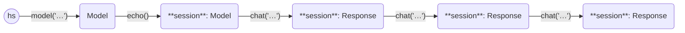

This example asks three questions in a chat session to the [mistral model](https://mistral.ai/news/announcing-mistral-7b/).

```python
from haverscript import connect

session = connect("mistral").echo()
session = session.chat("In one sentence, why is the sky blue?")
session = session.chat("Rewrite the above sentence in the style of Yoda")
session = session.chat("How many questions did I ask?")
```

Here is the output from running this example.

```markdown
> In one sentence, why is the sky blue?

The sky appears blue due to scattering of sunlight by molecules and particles
in the Earth's atmosphere, more strongly in shorter wavelengths (blue light)
than longer wavelengths (red, orange, and violet light), a phenomenon called
Rayleigh scattering.

> Rewrite the above sentence in the style of Yoda

In the sky, blue hue is, caused by scattering of sunlight, it is. By molecules
and particles in the Earth's atmosphere, more strongly with shorter
wavelengths (blue) than longer wavelengths (red, orange, violet), this
phenomenon called Rayleigh scattering, we can say.

> How many questions did I ask?

You asked three questions in total. In the first question, you asked for a
one-sentence explanation of why the sky is blue. In the second question, you
asked me to rewrite that answer in the style of Yoda. And in the third
question, you asked how many questions you had asked.
```

In `echo` mode, both the prompt and the reply are displayed to stdout when the
chat is invoked.

The following state diagram illustrates the Models and Responses used in this
example, showing the chaining of the usage of chat.

----



----