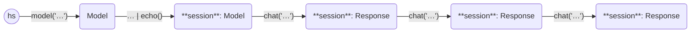

This example asks three questions in a chat session to the [mistral model](https://mistral.ai/news/announcing-mistral-7b/).

```python
from haverscript import connect, echo

# Create a new session with the 'mistral' model and enable echo middleware
session = connect("mistral") | echo()

session = session.chat("In one sentence, why is the sky blue?")
session = session.chat("What color is the sky on Mars?")
session = session.chat("Do any other planets have blue skies?")
```

Here is the output from running this example.

```markdown
> In one sentence, why is the sky blue?

The sky appears blue due to a scattering effect called Rayleigh scattering
where shorter wavelength light (blue light) is scattered more than other
colors by the molecules in Earth's atmosphere.

> What color is the sky on Mars?

The Martian sky appears red or reddish-orange, primarily because of fine dust
particles in its thin atmosphere that scatter sunlight preferentially in the
red part of the spectrum, which our eyes perceive as a reddish hue.

> Do any other planets have blue skies?

Unlike Earth, none of the other known terrestrial planets (Venus, Mars,
Mercury) have a significant enough atmosphere or suitable composition to cause
Rayleigh scattering, resulting in blue skies like we see on Earth. However,
some of the gas giant planets such as Uranus and Neptune can appear blueish
due to their atmospheres composed largely of methane, which absorbs red light
and scatters blue light.

```

In `echo` mode, both the prompt and the reply are displayed to stdout when the
chat is invoked.

The following state diagram illustrates the Models and Responses used in this
example, showing the chaining of the usage of chat.

----



----