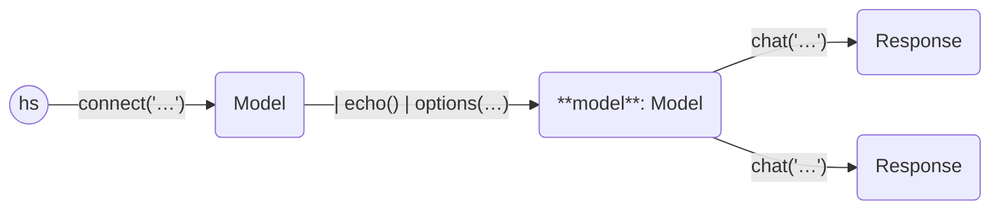

```python
from haverscript import connect, echo, options

model = (
    connect("mistral") | echo() | options(num_ctx=4 * 1024, temperature=1.0, seed=12345)
)

model.chat("In one sentence, why is the sky blue?")
model.chat("In one sentence, why is the sky blue?")
```

`options` is a method that sets ollama options internally inside a `Model` (or `Response`).

Running the above code gives the following output:

```
> In one sentence, why is the sky blue?

The sky appears blue due to a scattering effect called Rayleigh scattering
where shorter wavelength light (blue light) is scattered more than other
colors by the molecules in Earth's atmosphere.

> In one sentence, why is the sky blue?

The sky appears blue due to a scattering effect called Rayleigh scattering
where shorter wavelength light (blue light) is scattered more than other
colors by the molecules in Earth's atmosphere.
```

Note that since we use `seed=12345`, the calls to the LLM produce the same result.


The following are known options, as used by the [Ollama REST
API](https://github.com/ollama/ollama/blob/main/docs/api.md).


```
    num_ctx: int
    num_keep: int
    seed: int
    num_predict: int
    top_k: int
    top_p: float
    tfs_z: float
    typical_p: float
    repeat_last_n: int
    temperature: float
    repeat_penalty: float
    presence_penalty: float
    frequency_penalty: float
    mirostat: int
    mirostat_tau: float
    mirostat_eta: float
    penalize_newline: bool
    stop: Sequence[str]
```

----



----
