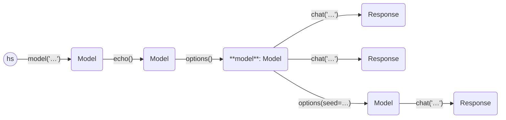

```python
import haverscript as hs

model = hs.model("mistral").echo().options(num_ctx=4 * 1024, temperature=1.8, seed=1234)

model.chat("In one sentence, why is the sky blue?")
model.chat("In one sentence, why is the sky blue?")
model.options(seed=34567).chat("In one sentence, why is the sky blue?")
```

`options` is a method that sets ollama options internally inside a `Model` (or `Response`).

Running the above code give the following output:

```
> In one sentence, why is the sky blue?

The sky appears blue due to scattering of shorter wavelengths (blue and violet) of sunlight
more than other colors as they travel through the Earth's atmosphere.

> In one sentence, why is the sky blue?

The sky appears blue due to scattering of shorter wavelengths (blue and violet) of sunlight
more than other colors as they travel through the Earth's atmosphere.

> In one sentence, why is the sky blue?

The sky appears blue due to scattering of sunlight by molecules and particles in the Earth's
atmosphere, more specifically scattering of shorter wavelengths (blue and violet) more
than longer wavelengths (red, orange, and yellow).
```

Note that because we use `seed=12345`, we get the same result for the first two calls to the LLM.

The following a known options, as used by the [Ollama REST API](https://github.com/ollama/ollama/blob/main/docs/api.md).


    num_ctx: int
    num_keep: int
    seed: int
    num_predict: int
    top_k: int
    top_p: float
    tfs_z: float
    typical_p: float
    repeat_last_n: int
    temperature: float
    repeat_penalty: float
    presence_penalty: float
    frequency_penalty: float
    mirostat: int
    mirostat_tau: float
    mirostat_eta: float
    penalize_newline: bool
    stop: Sequence[str]

----



----
