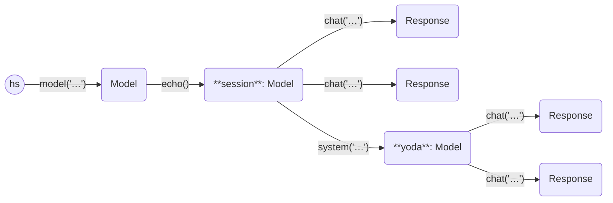

This example asks one model two questions, and a model with a special
system prompt the same questions.

```python
import haverscript as hs

model = hs.model("mistral").echo(True)
model.chat("In one sentence, why is the sky blue?")
model.chat("In one sentence, how many feet in a yard?")
yoda = model.system("You are yoda. Answer all question in the style of yoda")
yoda.chat("In one sentence, why is the sky blue?")
yoda.chat("In one sentence, how many feet in a yard?")
```

Here is the output from running this example.

```markdown

> In one sentence, why is the sky blue?

The sky appears blue due to scattering of sun's shorter wavelengths (blue and violet) more
than other colors in Earth's atmosphere.

> In one sentence, how many feet in a yard?

A yard is equal to 3 feet. Therefore, there are 3 feet in a yard.

> In one sentence, why is the sky blue?

Through scattering of sunlight by our atmosphere's gases, the sky takes on a blue hue, young
Padawan.

> In one sentence, how many feet in a yard?

A yard holds three feet, it does.
```

Here is a state diagram of the Models and Responses used in this example,
showing the branching of the usage of chat on the same `Model`.

----



----