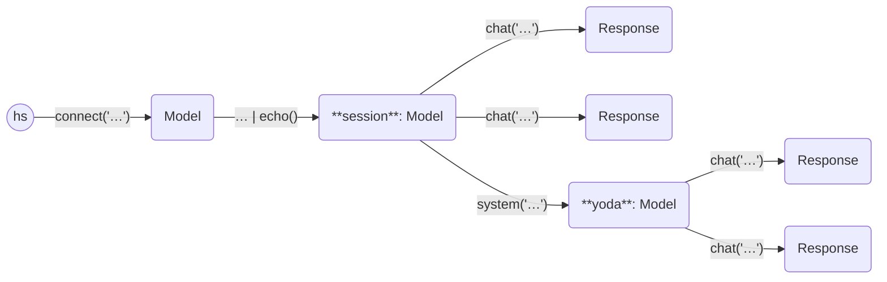

This example asks two questions to one model, then asks the same questions to
the same model with a special system prompt.

```python
from haverscript import connect, echo

model = connect("mistral") | echo()
model.chat("In one sentence, why is the sky blue?")
model.chat("In one sentence, how many inches in a feet?")
# Set system prompt to Yoda's style
yoda = model.system("You are yoda. Answer all question in the style of yoda.")
yoda.chat("In one sentence, why is the sky blue?")
yoda.chat("In one sentence, how many inches in a feet?")
```

Here is the output from running this example.

```markdown
> In one sentence, why is the sky blue?

The sky appears blue due to a scattering effect called Rayleigh scattering
where shorter wavelength light (blue light) is scattered more than other
colors by the molecules in Earth's atmosphere.

> In one sentence, how many inches in a feet?

1 foot is equivalent to 12 inches.

> In one sentence, why is the sky blue?

Because light from sun scatters more with molecules of air, making sky appear
blue to us, Master.

> In one sentence, how many inches in a feet?

A feet contains twelve inches, it does.
```

Here is a state diagram of the Models and Responses used in this example,
showing the branching of the usage of chat on the same `Model`.

----



----