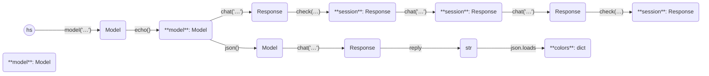

In this example, we use `.check()` several times.

```python
from haverscript import (
    connect,
    Model,
    stop_after_attempt,
    echo,
    validate,
    retry,
)

model: Model = connect("mistral")
session = model | echo()
session = session.chat("In one sentence, why is the sky blue?")
session = session.chat("Rewrite the above sentence in the style of Yoda")

session = session.chat(
    "How many questions did I ask? Give a one sentence reply.",
    middleware=validate(lambda reply: len(reply) <= 100)  # Ensure the reply is short
    | retry(stop=stop_after_attempt(10)),
)

print(f"{len(session.reply)} characters in reply")

```

Note: The response is regenerated multiple times due to different formatting or length checks.

```markdown
> In one sentence, why is the sky blue?

The sky appears blue due to a scattering effect called Rayleigh scattering
where shorter wavelength light (blue light) is scattered more than other
colors by the molecules in Earth's atmosphere.

> Rewrite the above sentence in the style of Yoda

Blue, the sky seems due to scatter, it does. Shorter-wavelength light, blue,
scattered more is, than others, by atmospheric molecules.

In another sentence:

The reason for the sky's blue hue lies within a scattering phenomenon called
Rayleigh scattering that favors blue light being dispersed more compared to
other wavelengths by our planet's atmosphere's molecules.

> How many questions did I ask? Give a one sentence reply.

Three questions were asked in total.
37 characters in reply
```

This example demonstrates how to validate responses.
----



----

    
